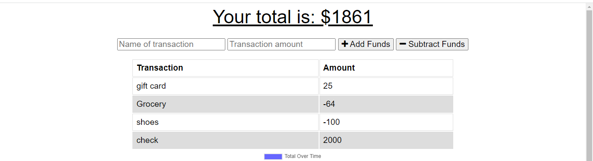
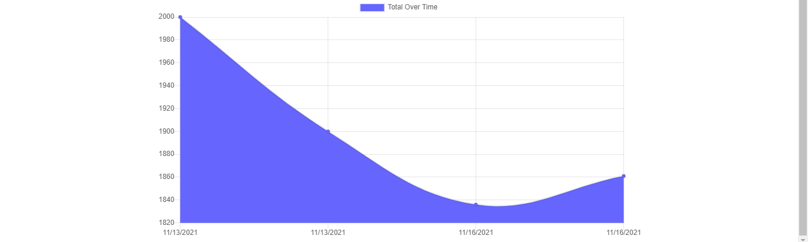

# Progressive_Budget

## Task

Our task is to add functionality to our existing Budget Tracker application to allow for offline access and functionality.

The user will be able to add expenses and deposits to their budget with or without a connection. When entering transactions offline, they should populate the total when brought back online.

Offline Functionality:

  * Enter deposits offline

  * Enter expenses offline

When brought back online:

  * Offline entries should be added to tracker.

## User Story

```md
AS AN avid traveller
I WANT to be able to track my withdrawals and deposits with or without a data/internet connection
SO THAT my account balance is accurate when I am traveling.
```

##  Business Context

Giving users a fast and easy way to track their money is important, but allowing them to access that information anytime is even more important. Having offline functionality is paramount to our applications success.

## Description

 

```md
GIVEN a user is on Budget App without an internet connection
WHEN the user inputs a withdrawal or deposit
THEN that will be shown on the page, and added to their transaction history when their connection is back online.
```

## Mock Up




## Table Of Contents

- [Installation](#installation)
- [Usage](#usage)
- [Test](#test)
- [License](#license)
- [Contribution](#contribution)
- [Contact](#contact)
- [Questions](#questions)
    
## Installation 

The following necessary dependencies must be installed to run the application.

 mongoDB Atlas, Express, mongoose, morgan, compression, lite-server, Heroku

## Usage

 Application can be invoked by npm start or  node server.js command in terminal or user can use deployed to Heroku link to access application.

## Test
  N/A
## License

This project is licensed under :

 [MIT](https://opensource.org/licenses/MIT)

For more information about the license, check the above link.

## Contribution

Coding Boot camp provided starter code.

## Contact

* GitHub :[bindi-v](https://github.com/bindi-v)

* Email : bindi.vaghela@gmail.com
    
## Questions

If you have any questions, please reach out to my Github.

### Deployed Link

* [The URL of the deployed application on Render!](https://progressive-budget.onrender.com)

* [The URL to the Github repository](https://github.com/bindi-v/Progressive_Budget)

#### Thank you for visiting my Github!